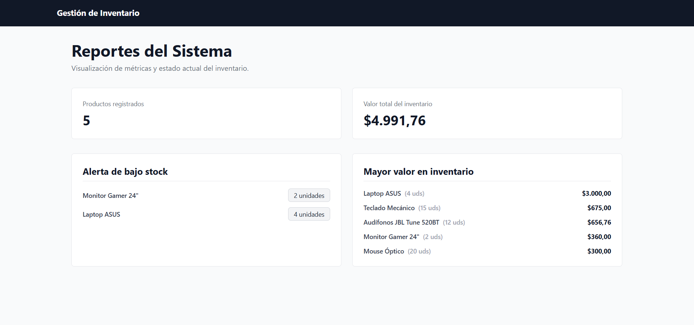

# Gestion de Inventario con Docker y Tailscale
# Sistema de Inventario Distribuido - Backend y Reportes
**Materia:** Sistemas Distribuidos | Periodo: 2026-1 | Estado: Completado

## Descripcion
El presente proyecto tiene como objetivo el diseño y despliegue de un Sistema de Inventario Distribuido, orientado a resolver las necesidades de gestión de productos de una pequeña empresa. Este sistema ha sido desarrollado bajo un enfoque de microservicios utilizando contenerización, lo que permite que los distintos componentes del software operen de manera independiente, y en hardware físicamente separado.

Cada servicio independendiente esta dentro de este repositorio dividido en las siguientes ramas: 
1. [app-inventario](https://github.com/jvit04/GestionInventario_Contenedores/tree/app-inventario): Servicio que gestiona el CRUD del inventario de productos.
2. [database-report](https://github.com/jvit04/GestionInventario_Contenedores/tree/database-report): Servicio que recibe los cambios en la base y despliega mediante una interfaz simple el reporte de inventario.

## Equipo de trabajo
- Leonor Molina - Estudiante 1: Aplicación de Gestión ([Leomz21](https://github.com/Leomz21))
- José Viteri - Estudiante 2: Base de Datos y Reportes ([jvit04](https://github.com/jvit04))

## Capturas / Demo

## Funcionalidad
- [x] **Base de Datos Aislada:** Contenedor de PostgreSQL inicializado con script `.sql` y persistencia de datos mediante volúmenes de Docker [a13f7738c2689c74814844436b9bdb9f619cbdf5](https://github.com/jvit04/GestionInventario_Contenedores/commit/a13f7738c2689c74814844436b9bdb9f619cbdf5).
- [x] **Red Privada Virtual:** Integración con Tailscale para recibir conexiones remotas seguras en el puerto 5433 desde el nodo del Estudiante 1 [COMPLETAR con URL al commit].
- [x] **Panel de Reportes Web:** Interfaz generada con Node.js y EJS que muestra el valor total del inventario y el Top 5 de productos más valiosos [[8790f3d14b463ba88e52acc78a49d2836230cfd1](https://github.com/jvit04/GestionInventario_Contenedores/commit/8790f3d14b463ba88e52acc78a49d2836230cfd1)].

## Tecnologías
`Node.js` `Express` `EJS` `PostgreSQL` `Docker` `Docker Compose` `Tailscale` `Tailwind CSS`

## Ejecución
### Instrucciones paso a paso
Requisitos previos: Tener instalado Docker, Docker Desktop y Tailscale.
1. Paso 1: Instrucciones para clonar los repositorios.
2. Paso 2 (Dispositivo 2): Comando para levantar la base de datos y reportes (docker-compose up -d --build).
3. Paso 3 (Dispositivo 1): Configuración del .env con la IP de Tailscale y comando para levantar la app de gestión. 
